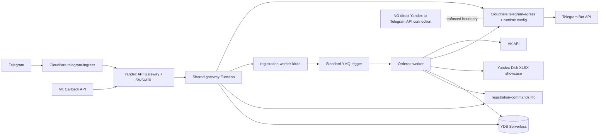
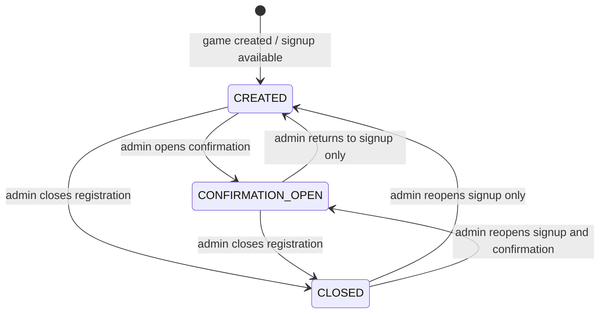
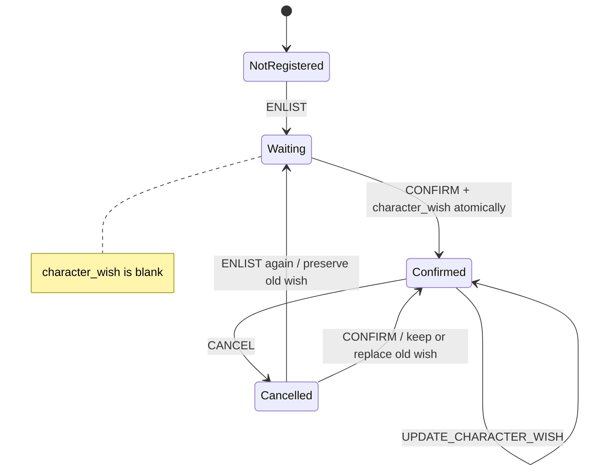
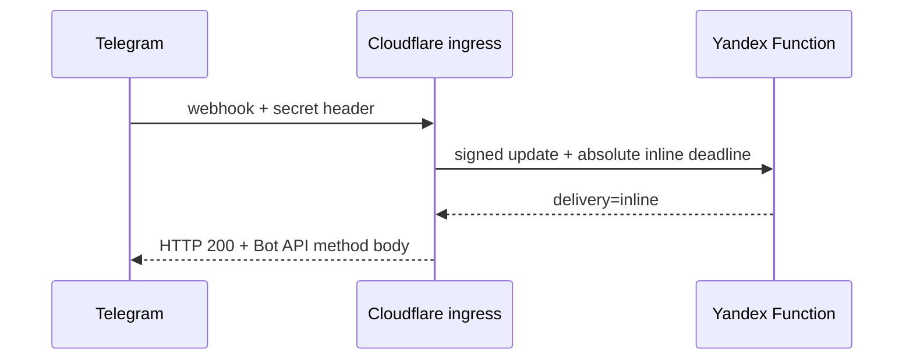
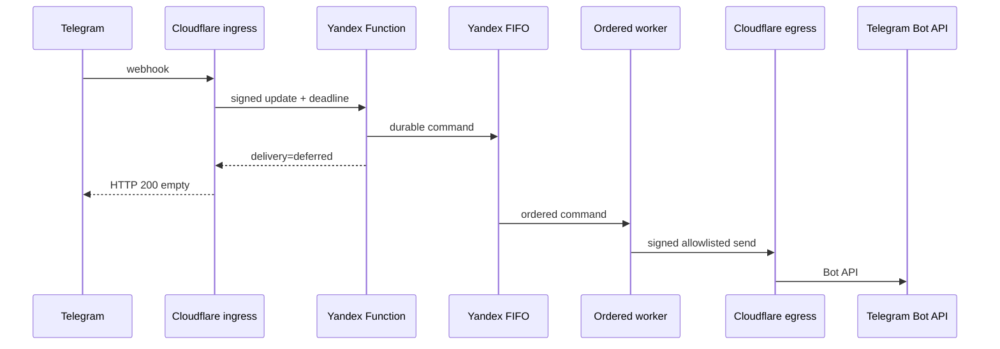

# LARP registration bot

Production-oriented Telegram and VK community bots for LARP profile collection, per-game registration, attendance confirmation, and administration. Both gateways use one Python domain/application layer. Profiles, events, and registrations live in four YDB tables; each game owns one stable public XLSX showcase on Yandex Disk.

The default user-facing language is Russian. Python 3.12 is required.

## Architecture



The boundaries are:

- `domain`: strict, platform-independent models and invariants;
- `application`: shared conversation state machine and use cases;
- `adapters/telegram` and `adapters/vk`: update parsing/rendering only;
- `adapters/ydb`: authoritative user, event, registration, dialog, and recent-delivery persistence;
- `adapters/yandex_disk`: public XLSX showcase creation and projection;
- `adapters/ymq`: authoritative FIFO publishing, wake-up publishing, and consuming;
- `adapters/runtime_config`: OIDC-authenticated Worker configuration, cached for at most 60 seconds;
- `functions/gateway` and `functions/ordered_worker`: Yandex entry points;
- `cloudflare/telegram-*`: isolated Telegram transport.

The old `main.py` was a 286-line Telegram polling script with an in-memory aiogram FSM, one profile workbook, one registration workbook, synchronous mutation, raw Telegram IDs in XLSX, and character wishes collected during enlistment. It has been replaced by a webhook-only Function entry point. Its Russian profile questions and co-player preferences remain the behavioral baseline.

## Domain model and character-wish lifecycle

There is deliberately no `character_wish` field on `TelegramUser`, `VkUser`, `tg_users`, or `vk_users`. Pydantic rejects unknown fields, and a contract test prevents this field from being reintroduced.

Every game has exactly three states. Admins may move a game freely between them:



The admin interface names these states `Регистрация`, `Подтверждение`, and `Закрытие регистрации`. Players may enlist in `CREATED` (`Регистрация`) and `CONFIRMATION_OPEN` (`Подтверждение`). They may confirm attendance only in `CONFIRMATION_OPEN`; `CLOSED` (`Закрытие регистрации`) accepts neither enlistment nor confirmation. Existing persisted `OPEN` events are interpreted as `CONFIRMATION_OPEN` during the rollout.



`ENLIST` asks only whom the player wants to play with. The prompt explicitly offers `Пропустить`; stale event-selection callbacks are rejected instead of being stored as player text. A new YDB row is `Ожидается` with an empty character wish. `CONFIRM` is the first normal place that asks for character wishes and writes the wish plus `Подтверждено` to the authoritative row before regenerating the showcase. `Без пожеланий` is stored literally, so it remains distinct from “not asked yet.”

The same user has a different deterministic participant key for every event. Registrations are keyed by event in YDB, therefore:

```text
Game A registration.character_wish != Game B registration.character_wish
```

Editing a wish changes only the character field, operation ID, and timestamp. Cancelling changes only status. Re-enlisting after cancellation updates the wanted co-player preference, returns to `Ожидается`, and preserves the old wish. A confirmed user updating that preference stays confirmed.

## Storage

### YDB

Terraform declares exactly these application tables:

| Table | Primary key | Purpose |
|---|---|---|
| `tg_users` | `tg_id` | Telegram profile, mandatory VK URL, FSM context, update/delivery metadata |
| `vk_users` | `vk_id` | VK profile, optional Telegram handle, FSM context, update/delivery metadata |
| `events` | `event_id` | Name, stable Disk resource path/public URL, status, migration timestamp |
| `registrations` | `(event_id, participant_key)` | Authoritative per-game registration, public profile projection, attendance, operation metadata |

The composite registration key makes exact participant lookups constant-cost and keeps every game's rows contiguous for an efficient showcase rebuild. No secondary index or duplicated participant array is maintained. Profile/FSM writes use parameterized YQL and serializable read/write semantics. Event pages are keyset-ordered by `(created_at, event_id)` and never load the complete history just to paginate.

### XLSX

Every event owns `disk:/larp-bot/events/<uuid>-<slug>.xlsx`. It is uploaded once, published once, and overwritten in place from the current YDB registration rows after ordinary mutations, preserving the public URL. It is a disposable read-only showcase, never application state.

Visible columns:

```text
№
Имя
Предыдущий опыт в LARP
Готовность к кроссполу
С кем хочу играть
Пожелания по персонажу
Текущий статус
```

There are no technical or hidden columns. The participant key, operation ID, and timestamps exist only in YDB. User text beginning with `=`, `+`, `-`, or `@` is prefixed with the established spreadsheet apostrophe escape to prevent formula execution.

The public workbook intentionally exposes row number, display name, prior LARP experience, readiness for cross-gender play, wanted co-player preference, character wishes, and attendance status. Legal/pass names, email, citizenship, raw IDs, participant keys, operation metadata, and credentials never enter it. Operators must disclose to players that these fields are public. On first access after rollout, legacy stateful workbooks are imported idempotently into YDB and immediately replaced with the visible-only projection; `events.registrations_migrated_at` prevents later XLSX reads.

Malformed legacy XLSX aborts migration without setting the migration timestamp. After migration, damaged or manually edited showcase files are safely regenerated from YDB on the next mutation.

## FIFO ordering and failure behavior

All conflicting operations use `registration-commands.fifo` with:

```text
MessageGroupId = event_id
MessageDeduplicationId = operation_id
```

An operation ID is a deterministic UUID for one platform update. Each affected participant row also stores `last_operation_id`. Retry therefore does not logically reapply the mutation.

Yandex currently permits a native Message Queue Function trigger only for a standard queue. The intentional bridge is:

```text
FIFO command queue
    |
    | native Function trigger cannot consume FIFO
    v
standard kick queue
    |
    v
native YMQ Function trigger
    |
    v
bounded ordered FIFO drainer
```

Do not attach the trigger directly to FIFO unless Yandex officially adds support and this architecture is deliberately migrated. The kick has no business-ordering role. The publisher first makes the FIFO command durable, then emits a kick. If kick publishing fails, the platform retry uses the same operation ID: FIFO deduplicates the command while the retry emits another kick.

YDB or showcase-upload failures leave the FIFO message undeleted. A YDB mutation is authoritative even if showcase generation or bot delivery fails; retrying the same operation ID regenerates the showcase without logically reapplying the mutation. The delivery marker is written only after the transport accepts the response. All admin status changes and deletion share the same per-event FIFO group as participant mutations. Worker-time YDB state—not an earlier button or XLSX content—is authoritative.

## Telegram transport

Fast path:



Deferred ordered path:



Ingress accepts only POST, caps the body at 256 KiB, validates `X-Telegram-Bot-Api-Secret-Token`, and signs timestamp, request ID, method, path, and body hash. Defaults are a 1500 ms backend inline cutoff and 2500 ms ingress hard deadline. If Yandex starts after its deadline, it selects egress. If ingress reaches its hard deadline, it acknowledges Telegram with empty HTTP 200 while observing the already-started upstream request. Durable registration correctness exists only in Yandex FIFO, never in `waitUntil()`.

Egress accepts only `/telegram/send`, a ±60 second signature, a matching request ID, and `sendMessage` (the only Bot API method used by this application). It constructs the Bot API URL itself. One logical answer is either inline or egress-delivered, never intentionally both.

## VK transport

VK Callback API posts directly through API Gateway/SWS to the same gateway Function. The handler checks group ID and callback secret on every request. `confirmation` returns the configured confirmation string immediately. Other supported callbacks return `ok`; outbound messages use `messages.send` with a deterministic `random_id`. Telegram handle is optional and normalized to `@username` when present.

## Security model

- Every Telegram Cloudflare→Yandex request and Yandex→Cloudflare egress request uses HMAC-SHA256 with timestamp freshness and body integrity.
- Runtime Functions exchange their platform-provided IAM credentials for one-hour Yandex OIDC ID tokens. The egress Worker verifies the Yandex signature, exact audience, expiry, and an allowlist containing only the gateway and ordered-worker service accounts before returning runtime configuration.
- Admin IDs are JSON numeric arrays in the Worker configuration, cached no longer than 60 seconds. Every privileged action rechecks authorization.
- Event IDs and participant state are reloaded server-side; callback values are never trusted as authorization.
- Profile/pass data stays in private YDB and structured logs omit request bodies, email, legal names, and credentials.
- Smart Web Security in API mode and Advanced Rate Limiter enforce a configurable global 25 requests/second. It is intentionally not grouped by Cloudflare source IP.
- Function scaling defaults to three instances per function, one request per instance.
- All application secrets are installed as encrypted Worker bindings with `wrangler secret bulk` after Terraform. Yandex Functions receive only non-secret endpoint and identity configuration; secret values exist only in Worker bindings and short-lived Function memory.
- `.env*`, state, plans, build output, Wrangler state, and Python/Node caches are ignored.

## IAM

Terraform creates separate gateway, ordered-worker, kick-trigger, API-Gateway, and YMQ-client service accounts.

| Identity | Roles/purpose |
|---|---|
| gateway | `ydb.editor`; can mint an OIDC token only for its own service account |
| ordered worker | `ydb.editor`; can mint an OIDC token only for its own service account |
| YMQ client key owner | `ymq.reader`, `ymq.writer` |
| kick trigger | `ymq.reader`, invokes only ordered worker |
| API Gateway | invokes only gateway Function |

Runtime Functions do not receive `admin` or `editor`. The deployment identity needs service-specific infrastructure administration, IAM-binding permissions, and read access to the private Function-package bucket; scope it to the production folder.

## Local development

```bash
python3.12 -m venv .venv
.venv/bin/python -m pip install --upgrade pip
.venv/bin/python -m pip install -e '.[dev]'
.venv/bin/ruff format --check .
.venv/bin/ruff check .
.venv/bin/mypy
.venv/bin/pytest
python scripts/check_storage_constraint.py
bash scripts/check_telegram_isolation.sh
```

Workers:

```bash
cd cloudflare/telegram-ingress
npm ci
npm run typecheck
npm test
npm run build

cd ../telegram-egress
npm ci
npm run typecheck
npm test
npm run build
```

Build the deterministic Function ZIP:

```bash
bash scripts/build_function.sh
```

The package uses a fully pinned Python 3.12 runtime dependency closure. The ZIP writer fixes entry order, timestamp, mode, and compression settings.

## GitHub Actions setup

Create protected `production` and `production-plan` environments. Configure a Yandex Workload Identity OIDC federation with:

```text
issuer:   https://token.actions.githubusercontent.com
jwks:     https://token.actions.githubusercontent.com/.well-known/jwks
audience: https://github.com/ProfessorLayton322
subjects:
  repo:ProfessorLayton322@78860133/rolebot-hse@1341141222:environment:production
  repo:ProfessorLayton322@78860133/rolebot-hse@1341141222:environment:production-plan
```

This repository was created after GitHub enabled immutable OIDC subjects for new repositories, so the owner and repository IDs are required. An old username that merely redirects on github.com will not match the OIDC claim. Link both exact subjects to the dedicated deployment service account. If GitHub OIDC customization is changed later, the exchange step prints the exact subject that must be linked. The workflows exchange GitHub's short-lived OIDC token at `https://auth.yandex.cloud/oauth/token`; no Yandex authorized-key JSON is needed in GitHub.

### Required GitHub Secrets

These names are exhaustive for the supplied workflows:

| Secret | Where used / how to obtain |
|---|---|
| `CLOUDFLARE_API_TOKEN` | Cloudflare token with Account Workers Scripts edit/deploy and account read permissions |
| `TF_STATE_ACCESS_KEY_ID` | Static S3 access-key ID for the pre-created private Yandex Object Storage bucket; used for Terraform state and Function-package uploads |
| `TF_STATE_SECRET_ACCESS_KEY` | Matching S3 secret key; it must be allowed to read and write the Function-package object prefix |
| `TG_BOT_TOKEN` | BotFather token; installed only in telegram-egress and used by deployment to call `setWebhook` |
| `TG_WEBHOOK_SECRET` | Random webhook secret using only `A-Z a-z 0-9 _ -`; installed in ingress and passed to `setWebhook` |
| `YANDEX_DISK_TOKEN` | OAuth token for the dedicated Disk account/folder |
| `VK_ACCESS_TOKEN` | VK community access token with messaging permission |
| `VK_CALLBACK_SECRET` | Random secret configured identically in VK Callback API |
| `VK_CONFIRMATION_STRING` | VK's server-confirmation string |
| `VK_GROUP_ID` | Numeric community ID; treated as protected configuration |
| `PARTICIPANT_KEY_HMAC_SECRET` | At least 32 random bytes, high-entropy; rotation changes lookup keys and requires a migration |
| `CF_TO_YANDEX_HMAC_SECRET` | At least 32 random bytes; installed in ingress and the egress runtime-config Worker |
| `YANDEX_TO_CF_EGRESS_HMAC_SECRET` | At least 32 random bytes; installed in the egress Worker and provided to authenticated Yandex runtimes |

The YMQ access key is generated by Terraform and copied directly to the egress Worker by `deploy.yml`; do not create `YMQ_ACCESS_KEY_ID` or `YMQ_SECRET_ACCESS_KEY` GitHub Secrets. `YANDEX_GATEWAY_URL`, the runtime-config URL/audience, and allowed Yandex service-account IDs are Terraform outputs or derived values injected into Workers and Functions; none is a GitHub Secret.

Generate secrets locally without printing them into shell history:

```bash
openssl rand -hex 32       # each HMAC secret
openssl rand -hex 24       # Telegram webhook secret (allowed character set)
```

### Required GitHub Variables

| Variable | Meaning |
|---|---|
| `YC_CLOUD_ID` | Production Yandex cloud ID |
| `YC_FOLDER_ID` | Production folder ID |
| `YC_WIF_AUDIENCE` | Audience configured on the Yandex workload identity federation; must match exactly |
| `YC_DEPLOY_SERVICE_ACCOUNT_ID` | Deployment SA linked to the GitHub subject |
| `CLOUDFLARE_ACCOUNT_ID` | Cloudflare account ID |
| `CLOUDFLARE_WORKERS_SUBDOMAIN` | Account subdomain without `.workers.dev` |
| `TF_STATE_BUCKET` | Existing private versioned Object Storage bucket name; Function packages are stored under `larp-bot/functions/` in the same bucket |
| `TG_ADMIN_IDS` | Public JSON array of numeric Telegram user IDs, e.g. `[12345678]` |
| `VK_ADMIN_IDS` | Public JSON array of stable numeric VK user IDs, e.g. `[87654321]`; resolve vanity handles before adding them |

### OIDC-protected runtime configuration

`deploy.yml` installs these values as encrypted `telegram-egress` Worker bindings. The `/runtime/config` route returns the subset needed by Yandex only after verifying a Yandex-signed OIDC ID token:

```text
YANDEX_DISK_TOKEN
VK_ACCESS_TOKEN
VK_CALLBACK_SECRET
VK_CONFIRMATION_STRING
VK_GROUP_ID
TG_ADMIN_IDS
VK_ADMIN_IDS
PARTICIPANT_KEY_HMAC_SECRET
CF_TO_YANDEX_HMAC_SECRET
YANDEX_TO_CF_EGRESS_HMAC_SECRET
YMQ_ACCESS_KEY_ID
YMQ_SECRET_ACCESS_KEY
```

### Cloudflare Worker secrets

`telegram-ingress`:

```text
TG_WEBHOOK_SECRET
CF_TO_YANDEX_HMAC_SECRET
YANDEX_GATEWAY_URL
```

`telegram-egress`:

```text
TG_BOT_TOKEN
YANDEX_TO_CF_EGRESS_HMAC_SECRET
YANDEX_DISK_TOKEN
VK_ACCESS_TOKEN
VK_CALLBACK_SECRET
VK_CONFIRMATION_STRING
VK_GROUP_ID
TG_ADMIN_IDS
VK_ADMIN_IDS
PARTICIPANT_KEY_HMAC_SECRET
CF_TO_YANDEX_HMAC_SECRET
YMQ_ACCESS_KEY_ID
YMQ_SECRET_ACCESS_KEY
YANDEX_OIDC_AUDIENCE
YANDEX_SERVICE_ACCOUNT_IDS
```

## First deployment

1. Create the Telegram bot, VK community, dedicated Yandex Disk OAuth token, Cloudflare account, and active Yandex billing folder.
2. Create a private, versioned Object Storage bucket for Terraform state. Create a dedicated state service-account static S3 key and put its two parts in `TF_STATE_*` GitHub Secrets.
3. Create a Yandex deployment service account with service-specific roles needed to manage IAM accounts/bindings, Functions, API Gateway, YDB, YMQ, Logging, and Smart Web Security, plus `storage.viewer` for the private Function-package bucket. Do not reuse a runtime account.
4. Create the GitHub OIDC workload identity federation and federated credentials for the exact `production` and `production-plan` environment subjects. Add the nine GitHub Variables above.
5. Add all thirteen GitHub Secrets above to the protected `production` environment. Mirror non-deployment credentials needed for plan into `production-plan` (`CLOUDFLARE_API_TOKEN` and both state keys).
6. Run CI on a pull request. Review `plan.yml`, especially IAM bindings, four YDB tables, and public Worker endpoints.
7. Merge to `main`. The serialized deployment tests, builds, applies Terraform, injects every application secret into Workers, calls Telegram `setWebhook`, and runs live Telegram/VK smoke tests.
8. In VK community settings, add the emitted `vk_callback_url`, set the same callback secret, select the current API version, confirm the server using `VK_CONFIRMATION_STRING`, and enable message events.
9. Send `/start` to Telegram and a message to the VK community. Create a test game as an admin, open the returned public workbook URL, enlist while confirmation is unavailable, change its Статус to `Подтверждение`, confirm with a wish, change it to `Закрытие регистрации`, and verify signup and confirmation are unavailable.
10. Verify YDB contains `tg_users`, `vk_users`, `events`, and `registrations`; verify the Telegram webhook points to `*.workers.dev`, never the Yandex gateway.

## Telegram setup details

The deployment runs:

```text
setWebhook(
  url=<Cloudflare ingress URL>,
  secret_token=<TG_WEBHOOK_SECRET>,
  allowed_updates=[message, callback_query],
  drop_pending_updates=false
)
```

To inspect without exposing the token, call `getWebhookInfo` from a protected operator shell. Expected URL: Cloudflare ingress. Polling and `getUpdates` are not production options.

## VK setup details

Use the Terraform `vk_callback_url`, numeric `VK_GROUP_ID`, matching `VK_CALLBACK_SECRET`, and the generated `VK_CONFIRMATION_STRING`. Enable community messages and `message_new`. A `confirmation` request must return only the confirmation string; authenticated normal callbacks receive `ok`.

## Admin management

Update the public GitHub Actions repository variable `TG_ADMIN_IDS` or `VK_ADMIN_IDS` and rerun `deploy.yml`. Values must be JSON arrays of stable numeric platform IDs—not usernames. Resolve a VK vanity URL such as `vk.ru/foobar` to its numeric user ID first; aliases can change, while numeric IDs are stable. The workflow replaces the Worker binding and warm Functions refresh within 60 seconds.

Every create/close/delete request rechecks the latest admin set. Deletion requires the exact case-sensitive game name after trimming outer whitespace. Admin listing is oldest-first with exactly ten entries per page.

## Secret rotation

- Rotate Telegram/VK/Disk tokens in their provider first, update GitHub Secrets, then redeploy.
- Rotate both transport HMACs in a coordinated deploy because both ends must match. A short interruption is safer than temporarily accepting two secrets.
- Rotate `TG_WEBHOOK_SECRET` by updating GitHub and redeploying; the workflow injects ingress before calling `setWebhook`.
- Rotate the Terraform-state key at least every 90 days and update both `TF_STATE_*` secrets.
- Rotate the Terraform-managed YMQ key by replacing `yandex_iam_service_account_static_access_key.ymq_client`; the deployment copies the new value to the Worker before normal traffic should resume.
- Do not casually rotate `PARTICIPANT_KEY_HMAC_SECRET`: existing YDB registration rows become undiscoverable. Plan a migration that rewrites all participant keys first.

Worker binding updates create a new encrypted Worker version; Yandex runtimes never pin a binding version.

## Terraform resources

Terraform manages:

- five least-purpose service accounts, runtime IAM and invocation bindings;
- one Serverless YDB database and four application tables;
- one FIFO command queue and one standard kick queue;
- gateway and ordered-worker Functions, versions, logging, and scaling policies;
- one standard-queue Function trigger (never a FIFO trigger);
- one API Gateway with two POST routes;
- Smart Web Security and Advanced Rate Limiter profiles;
- two Cloudflare Worker objects, versions, deployments, and workers.dev bindings.

Run manually only after building artifacts:

```bash
bash scripts/build_function.sh
(cd cloudflare/telegram-ingress && npm ci && npm run build)
(cd cloudflare/telegram-egress && npm ci && npm run build)

export YC_STORAGE_ACCESS_KEY="$AWS_ACCESS_KEY_ID"
export YC_STORAGE_SECRET_KEY="$AWS_SECRET_ACCESS_KEY"
export TF_VAR_function_package_bucket="$TF_STATE_BUCKET"

cd infra/terraform
terraform init \
  -backend-config="bucket=$TF_STATE_BUCKET" \
  -backend-config="key=larp-bot/production.tfstate"
terraform fmt -check -recursive
terraform validate
terraform plan
```

## Tests and enforced contracts

Python tests cover profile differences, absence of global character wishes, the freely selectable three-state game model, signup before confirmation opens, ordered status changes, per-event isolation, blank vs explicit wishes, atomic confirm, preservation on edit/cancel/re-enlist, duplicate operation IDs, formula injection, close/delete ordering, exact-name deletion, pagination boundaries, HMAC/body/timestamp validation, Telegram inline/deferred exclusivity, VK confirmation/authentication, and worker sequencing.

Worker tests cover fast inline, explicit deferred, hard timeout, webhook auth, egress HMAC freshness, method allowlisting, Yandex OIDC verification/runtime-config isolation, and the only direct Telegram connection. CI additionally checks Terraform formatting/validation, dependency vulnerabilities, secret leakage, the four-table YDB model, no FIFO native trigger, and no direct Telegram endpoint under `src/larp_bot`.

## Observability

Use structured event fields `request_id`, `operation_id`, `event_id`, `platform`, and `platform_update_id`. Never add raw webhook bodies or dialog context to logs. Trace a registration as:

```text
Telegram update -> ingress request ID -> gateway update ID -> FIFO operation ID
-> worker event ID -> egress operation ID
```

Search Yandex Logging by operation/event ID. Cloudflare logs should contain request IDs, status, and timing only.

## Rate limits and cost control

`webhook_rate_limit_rps` defaults to 25 globally across both gateway routes. Increase only after reviewing real Callback/Telegram rates and Function/YDB quotas. Do not group by Cloudflare egress IP. `gateway_max_instances` and `worker_max_instances` default to three. YDB throttles at 20 RCU and has no provisioned capacity. Logs retain 72 hours. FIFO messages retain 14 days; kicks retain one day. No provisioned Function instances are enabled.

## Troubleshooting

**Telegram receives no answer:** check `getWebhookInfo`, ingress Worker secret presence, Cloudflare status, then gateway logs by request ID. Confirm the webhook URL is Cloudflare. A 403 at Yandex usually means HMAC mismatch or stale timestamp.

**Queued acknowledgment arrives but final success does not:** inspect FIFO depth, kick queue/trigger, worker logs, YDB errors, and Disk OAuth validity. Do not delete the FIFO message manually until the authoritative mutation is understood.

**VK confirmation fails:** compare numeric group ID, callback secret, and confirmation string with the current egress Worker bindings. The response body and Function content type are plain text.

**Runtime config returns 403:** confirm the Function uses the expected gateway/worker service account, its self-scoped `iam.serviceAccounts.tokenCreator` binding exists, and `YANDEX_OIDC_AUDIENCE` plus `YANDEX_SERVICE_ACCOUNT_IDS` match Terraform outputs. Never replace this with a long-lived shared authentication secret.

**Registration list is slow:** each page performs at most ten exact composite-primary-key YDB lookups with concurrency three. Inspect YDB throttling before changing the storage model.

**Workbook is malformed:** after migration, enqueue or retry a registration mutation to regenerate it from YDB at the same Disk resource path. During legacy migration, restore the last stateful workbook backup so its rows can be imported. Never publish a replacement resource because its public URL would change.

**Terraform cannot read YMQ:** verify the generated YMQ-client key in state and its `ymq.reader`/`ymq.writer` roles. State must remain private because the YMQ provider requires an SQS-compatible static key.

## Current platform constraints and deliberate deviations

The implementation was checked against current official documentation in August 2026:

- Yandex Cloud Functions supports `python312`.
- FIFO supports message groups and deduplication IDs, while native YMQ Function triggers support standard queues only.
- API Gateway supports Smart Web Security/ARL integration through `x-yc-apigateway.smartWebSecurity`.
- Cloudflare provider v5 supports Worker/version/deployment resources; Worker secrets are safer via Wrangler after Terraform.
- Telegram `setWebhook` supports `secret_token` and Bot API method responses in webhook HTTP 200 bodies.
- Yandex Workload Identity Federation supports exchanging GitHub OIDC JWTs for short-lived service-account IAM tokens, and Yandex service accounts can exchange IAM tokens for audience-bound ID tokens used with external OIDC consumers.

One provider constraint deserves attention: Terraform's Yandex Message Queue resource uses SQS-compatible static credentials. Terraform generates a dedicated, least-privilege key, so its secret necessarily exists in encrypted remote Terraform state. It is never a normal output, source value, Function environment variable, or GitHub Secret; CI copies the sensitive output straight to the egress Worker. Protect/version the state bucket and rotate this key. All other application secrets and Cloudflare secret bindings remain outside Terraform state.

## Repository layout

```text
.
├── main.py / ordered_worker.py
├── pyproject.toml / requirements.txt
├── src/larp_bot/
│   ├── domain/
│   ├── application/
│   ├── adapters/{telegram,vk,ydb,yandex_disk,ymq,runtime_config,transports}/
│   ├── config/
│   └── functions/{gateway,ordered_worker}/
├── cloudflare/
│   ├── telegram-ingress/{src,tests}/
│   └── telegram-egress/{src,tests}/
├── infra/terraform/
├── tests/{unit,contract}/
├── scripts/
└── .github/workflows/{ci,plan,deploy}.yml
```
