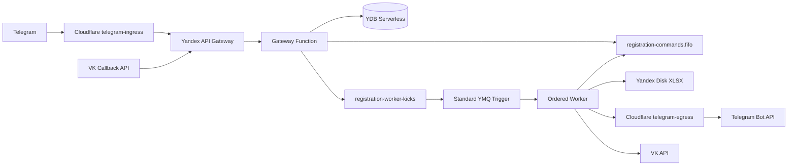
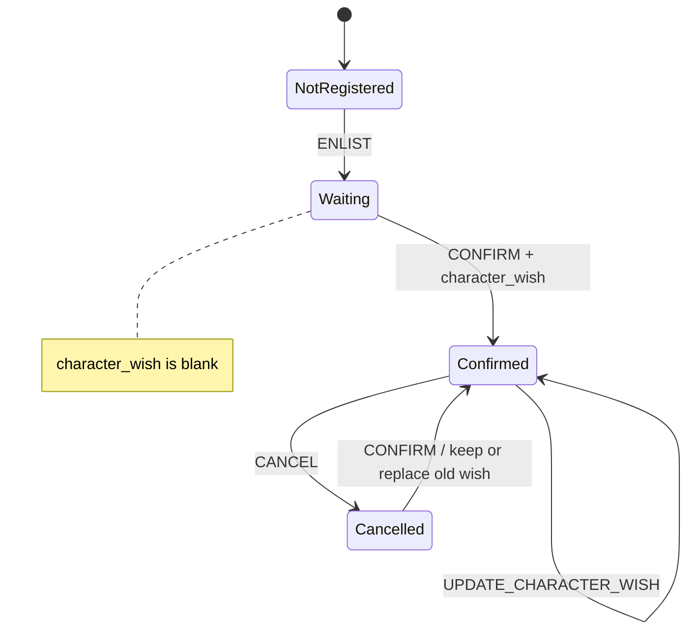
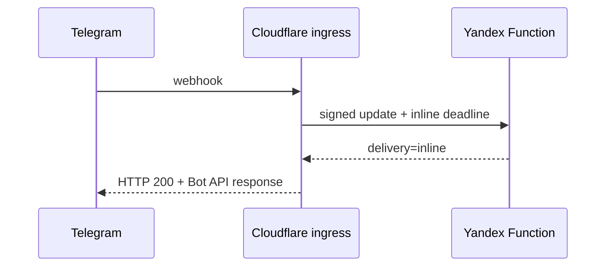
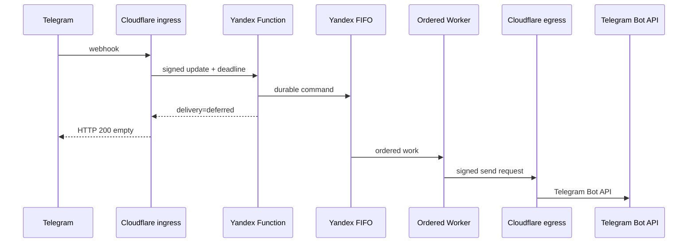

You are **Codex GPT-5.6 Sol, xhigh reasoning**, acting as the senior engineer responsible for designing, implementing, testing, documenting, and deploying this application.

Build the complete production-ready application, infrastructure, CI/CD, automated tests, and documentation.

Do not merely propose an architecture.

Do not stop after scaffolding.

Implement the system.

---

# 0. Existing application — read it first

There is an existing `main.py` Telegram bot in this repository.

**Read the entire file before making changes.**

Treat its user-facing profile fields and general event-registration concept as the behavioral baseline, but **do not preserve its architecture**.

The existing implementation currently uses:

- Telegram polling;
- aiogram FSM;
- Yandex Disk;
- XLSX files through `openpyxl`;
- synchronous workbook mutation;
- one profile workbook;
- one registration workbook.

Replace those architectural choices according to this specification.

Preserve these existing profile fields:

- full name;
- willingness to crossplay;
- previous LARP experience;
- whether a location pass is required;
- if a pass is required:
  - full legal name in Cyrillic;
  - full legal name in Latin characters;
  - email;
  - Russian citizenship yes/no.

Preserve these event-registration preference fields:

- people the player wants to play with;
- people the player does not want to play with.

## CRITICAL CHANGE FROM THE OLD BOT

The old bot asks for character wishes during initial game enlistment.

**Do NOT preserve that behavior.**

Character wishes:

- are NOT part of initial enlistment;
- are NOT part of the user's global profile;
- are unique to each specific game;
- start empty when the user first enlists;
- are first requested when the player confirms participation in that game;
- remain editable afterwards for that specific game;
- may be completely different for different games.

A player might:

1. enlist for Game A on Monday;
2. enlist for Game B on Tuesday;
3. think about Game A for several days;
4. confirm Game A on Friday and provide one character concept;
5. confirm Game B later and provide a completely different character concept;
6. later edit the Game A concept without changing anything about Game B.

The implementation MUST support this naturally.

There must be **no global `character_wish` field** in either user table.

---

# 1. Primary architecture

Implement **two bot gateways over one shared backend/domain layer**:

1. Telegram bot.
2. VKontakte community bot.

Both bots MUST use the same application/domain logic.

Do NOT implement two separate applications whose business rules happen to look similar.

Use clean architecture, ports/adapters, hexagonal architecture, or an equivalent clear separation.

At minimum separate:

- platform-independent domain models;
- application services/use cases;
- Telegram adapter;
- VK adapter;
- YDB repositories;
- Yandex Disk XLSX registration repository;
- ordered-command publisher;
- FIFO registration worker;
- admin configuration provider;
- Telegram transport;
- VK transport.

Platform handlers should translate incoming updates into shared application commands.

Business rules MUST NOT be duplicated between Telegram and VK.

---

# 2. Runtime

Use:

**Python 3.12**

Yandex Cloud Functions runtime:

```text
python312
```

Pin all dependencies.

Prefer small serverless-friendly dependencies.

Use typed Python.

Use:

- `pydantic` where useful for DTO/config validation;
- official/current YDB Python SDK;
- `httpx` or another lightweight async HTTP client;
- `openpyxl`;
- Yandex Disk REST API or a well-maintained lightweight library;
- pytest;
- Ruff;
- mypy or pyright.

Do not use Telegram or VK long polling in production.

---

# 3. YDB HARD STORAGE CONSTRAINT

There must be **exactly three application tables in YDB Serverless**:

1. `tg_users`
2. `vk_users`
3. `events`

There MUST NOT be any other application YDB table.

Do not create:

- registrations;
- attendance;
- character wishes;
- commands;
- queue state;
- outbox;
- idempotency;
- admins;
- sessions;
- audit;
- notification;
- game participants;

tables.

Game registration data belongs in each game's public XLSX workbook, NOT YDB.

---

# 4. Telegram user table

`tg_users`

Primary key:

```text
tg_id
```

Store the Telegram user's profile.

At minimum:

- `tg_id`;
- `full_name`;
- mandatory `vk_url`;
- `crossplay`;
- `larp_experience`;
- `needs_pass`;
- conditional pass fields;
- FSM/dialog state;
- minimal temporary dialog context;
- last Telegram update metadata required for safe duplicate handling;
- `created_at`;
- `updated_at`.

A Telegram user MUST provide a valid VK page address.

Do NOT accept:

```text
-
```

as a Telegram user's VK page.

Validate reasonable VK URL formats.

Do NOT store a global character concept or character wishes here.

---

# 5. VK user table

`vk_users`

Primary key:

```text
vk_id
```

At minimum:

- `vk_id`;
- `full_name`;
- optional `telegram_handle`;
- `crossplay`;
- `larp_experience`;
- `needs_pass`;
- conditional pass fields;
- FSM/dialog state;
- minimal temporary dialog context;
- last VK event metadata required for duplicate handling;
- `created_at`;
- `updated_at`.

Telegram handle is optional.

Accept:

- `@username`;
- `username`;
- blank/skip;
- `-`.

Normalize a supplied handle consistently.

Do NOT store global character wishes here.

---

# 6. Events table

`events`

Store only event/game metadata.

At minimum:

```text
event_id
name
disk_resource_path
public_registration_url
status
created_at
updated_at
```

Status:

```text
OPEN
CLOSED
```

Do NOT store participants inside `events`.

Do NOT store participant-character wishes inside `events`.

Do NOT store embedded JSON participant indexes.

---

# 7. User dialog/FSM state

Cloud Functions are stateless.

Therefore bot conversation state must not rely on Python process memory.

Persist FSM/dialog state in:

- `tg_users` for Telegram;
- `vk_users` for VK.

No separate session table.

Keep temporary dialog context minimal.

For example, while confirming participation it is acceptable to temporarily remember:

```text
selected_event_id
```

in dialog context.

Do not permanently store game registration information in the user row.

Where possible, when the final value arrives in the same invocation that can enqueue the durable command, send it directly to FIFO rather than redundantly persisting it in YDB.

Clear temporary dialog data after:

- success;
- cancellation;
- unrecoverable validation failure;
- timeout/reset as appropriate.

---

# 8. Registration storage

Each game has exactly one XLSX registration workbook stored on Yandex Disk.

Interpret “Yandex table” for this project as:

**a Yandex Disk XLSX file published through a stable public read-only URL.**

The public URL must remain stable for the lifetime of the game.

Do not invent an undocumented Yandex Sheets editing API.

Use XLSX because that follows the existing application's storage model.

---

# 9. One workbook per game

When an admin creates an event:

1. generate a stable `event_id`;
2. sanitize/generate a filename slug;
3. create a new XLSX workbook;
4. upload it to a deterministic Yandex Disk path;
5. publish that exact resource;
6. obtain its public URL;
7. create the `events` YDB record;
8. return the public URL to the admin.

Example resource path:

```text
disk:/larp-bot/events/<event-id>-<slug>.xlsx
```

If XLSX creation succeeds but the YDB event insert fails, delete the orphaned workbook.

Normal registration changes MUST update/overwrite the **same Yandex Disk resource**.

Never implement ordinary updates by deleting the old file and publishing a new one.

The public URL must remain constant.

Do not persist temporary download/upload URLs in YDB.

Store the stable public sharing URL.

---

# 10. Registration workbook schema

Suggested visible columns:

```text
Имя
С кем хочу играть
С кем не хочу играть
Пожелания по персонажу
Статус
```

Technical columns:

```text
participant_key
last_operation_id
updated_at
```

Technical columns may be hidden in the workbook.

However, never treat XLSX column hiding as a security feature.

## `participant_key`

Do not publicly expose raw:

- Telegram IDs;
- VK IDs;

unless there is a strong explicit reason.

Instead derive an opaque deterministic key, for example:

```text
HMAC(secret, platform + ":" + platform_user_id + ":" + event_id)
```

The secret belongs in Yandex Lockbox.

This lets the backend reliably find a participant row without publicly revealing the platform ID.

---

# 11. Character wishes — HARD DOMAIN RULE

`Пожелания по персонажу` is **registration-per-event data**.

It MUST NOT exist as a global user-profile property.

Suppose the same user participates in three games.

They may have:

```text
Game A -> "Хочу играть врача"
Game B -> "Хочу конфликт с семьёй"
Game C -> "Без пожеланий"
```

These values must be independent.

Changing Game B MUST NOT affect Game A or Game C.

Because each game has its own workbook, the durable character-wish value lives in the participant's row of that game's workbook.

## Initial enlistment

When ENLIST first creates the participant row:

```text
Пожелания по персонажу = blank
Статус = Ожидается
```

The bot MUST NOT ask for character wishes during ENLIST.

## Confirmation

The first normal UI moment where character wishes are requested is:

```text
Подтвердить участие
```

The user selects a game they previously enlisted in.

The bot then asks for character wishes for **that game**.

For example:

```text
Пожелания по персонажу для игры «Лесной предел»:

Опишите ваши идеи, пожелания или ограничения по персонажу.

Если специальных пожеланий нет, нажмите «Без пожеланий».
```

Buttons:

```text
Без пожеланий
Отмена
```

The user's answer is then included in the serialized `CONFIRM` command.

The CONFIRM mutation must atomically update:

```text
Пожелания по персонажу
Статус = Подтверждено
```

in the same workbook operation.

Do not first write the character idea and later send a separate confirmation command.

Confirmation plus the supplied character wishes are one logical ordered mutation.

## Existing wishes during re-confirmation

If a character-wish value already exists, show it first.

Example:

```text
Текущие пожелания по персонажу:

«Хочу роль с семейным конфликтом и минимум боёв.»

Отправьте новый текст, чтобы изменить его, либо выберите:
```

Buttons:

```text
Оставить без изменений
Без пожеланий
Отмена
```

A re-confirmation therefore does not accidentally erase previously entered wishes.

---

# 12. Editing character wishes after confirmation

Both bots must expose an explicit main-menu action:

```text
🎭 Пожелания по персонажу
```

This exists because users may refine their idea after confirming.

Flow:

1. show games for which this user has an existing registration;
2. user selects one;
3. load that game's registration row;
4. display:
   - game name;
   - registration status;
   - current character wishes;
5. if character wishes have never been entered and status is still `Ожидается`, tell the user that character wishes are first entered through `✅ Подтвердить участие`;
6. otherwise allow editing;
7. enqueue an ordered `UPDATE_CHARACTER_WISH` command;
8. update only that game's participant row.

Example:

```text
Игра: «Лесной предел»

Текущие пожелания:
«Хочу роль врача.»

Отправьте новый вариант.
```

Buttons:

```text
Без пожеланий
Отмена
```

Character-wish editing MUST NOT:

- change another game's character wishes;
- change `С кем хочу играть`;
- change `С кем не хочу играть`;
- change the user's profile;
- implicitly cancel attendance;
- implicitly reopen a closed game.

If the registration status is `Подтверждено`, editing the character wishes keeps it `Подтверждено`.

If the registration is `Отменено`, preserve the existing character text but normally do not expose editing until the player confirms again.

When a previously cancelled player confirms again, show the preserved character wishes and let them:

- keep them;
- replace them;
- select `Без пожеланий`.

---

# 13. Attendance states

Workbook participant status values:

```text
Ожидается
Подтверждено
Отменено
```

## ENLIST

New registration:

```text
Ожидается
```

If an existing `Отменено` participant enlists again for an OPEN game:

- update per-game enlistment preferences;
- move status to `Ожидается`;
- preserve old character wishes unless explicitly changed later.

If an already `Подтверждено` participant uses the enlistment flow merely to update co-player preferences:

- update those preferences;
- DO NOT downgrade them to `Ожидается`;
- preserve character wishes.

## CONFIRM

Sets:

```text
Статус = Подтверждено
```

and sets/updates the character-wish value from the confirmation interaction.

## CANCEL

Sets:

```text
Статус = Отменено
```

Do NOT physically delete the participant row.

Preserve:

- co-player preferences;
- character wishes.

This allows later restoration/reconfirmation without destroying information.

---

# 14. Main user interface

Telegram and VK must expose equivalent interface structures wherever each platform permits it.

Main menu:

```text
📝 Профиль
🎮 Записаться на игру
✅ Подтвердить участие
🎭 Пожелания по персонажу
❌ Отменить участие
```

For admins additionally show:

```text
🛠 Администрирование
```

Buttons/text should be idiomatic for each platform but semantically equivalent.

Default user-facing language:

**Russian.**

---

# 15. Profile flow — Telegram

`📝 Профиль`

If no profile exists, start registration.

If a profile exists, show current non-sensitive values and allow editing.

Initial flow:

1. `Введите ваши Фамилию и Имя:`
2. mandatory VK page URL;
3. ready to crossplay? Да/Нет;
4. played LARP before? Да/Нет;
5. need a location pass? Да/Нет;
6. if yes:
   - full name Cyrillic;
   - full name Latin;
   - email;
   - Russian citizen? Да/Нет;
7. save/update.

Telegram-specific difference:

**VK URL is mandatory.**

---

# 16. Profile flow — VK

Same overall flow.

The ONLY intentional profile-data interface difference is step 2.

Ask:

```text
Ваш Telegram username, если он есть:
```

Make it optional.

Buttons:

```text
Пропустить
```

Accept `-` as equivalent to not supplied.

All other profile questions and semantics should match Telegram.

---

# 17. Initial game enlistment — corrected flow

`🎮 Записаться на игру`

The user must have a complete profile first.

If not:

```text
Сначала зарегистрируйте профиль.
```

Then:

1. list OPEN games;
2. user selects one game;
3. ask:

```text
С кем бы вы ХОТЕЛИ играть?
```

4. ask:

```text
С кем бы вы НЕ ХОТЕЛИ играть?
```

5. show summary;
6. enqueue ENLIST;
7. notify user once the ordered mutation succeeds.

**STOP HERE.**

Do NOT ask:

```text
Ваши пожелания по персонажу
```

during this flow.

Do NOT store any character-wish data during initial enlistment.

The new participant row starts with:

```text
Пожелания по персонажу = blank
Статус = Ожидается
```

Example success text:

```text
🎲 Вы записаны на игру «<name>».

Когда придёт время окончательно подтвердить участие, выберите
«✅ Подтвердить участие».

Тогда бот попросит ваши пожелания по персонажу.
```

---

# 18. Confirm participation — corrected flow

`✅ Подтвердить участие`

The user must have an existing participant row for that game.

Flow:

1. show the user's existing game registrations;
2. user selects game;
3. load participant row;
4. show current status;
5. ask for character wishes for THAT event;
6. enqueue one `CONFIRM` command containing:
   - event;
   - participant;
   - character wishes;
7. FIFO worker updates character wishes and confirmation status atomically;
8. send success response.

Example success:

```text
✅ Участие в игре «<name>» подтверждено.

Пожелания по персонажу:
<value>

Позже вы сможете изменить их через
«🎭 Пожелания по персонажу».
```

If the user selects:

```text
Без пожеланий
```

store a normalized explicit value such as:

```text
Без пожеланий
```

rather than confusing it with “the user has not yet reached confirmation”.

This distinction matters.

Recommended representation:

- blank/empty = character question has never been completed;
- `Без пожеланий` = user explicitly says they have no wishes.

---

# 19. Character-wish edit flow

`🎭 Пожелания по персонажу`

This is separate from confirming attendance.

Use it for post-confirmation editing.

Example flow:

```text
🎭 Выберите игру:
```

After selection:

```text
Игра: Лесной предел
Статус: Подтверждено

Текущие пожелания:
Хочу роль врача.

Отправьте новые пожелания.
```

Buttons:

```text
Без пожеланий
Отмена
```

Enqueue:

```text
UPDATE_CHARACTER_WISH
```

Do not directly modify the XLSX from the HTTP handler.

After successful ordered processing:

```text
🎭 Пожелания для игры «Лесной предел» обновлены.
```

---

# 20. Cancel participation

`❌ Отменить участие`

Flow:

1. show games in which the user has a registration;
2. user selects one;
3. ask for confirmation;
4. enqueue CANCEL;
5. ordered worker sets:
   `Статус = Отменено`;
6. preserve all other row data.

Do not delete character wishes.

Do not delete the participant row.

---

# 21. Listing a user's registered games

There is intentionally NO registration index in YDB.

Therefore do NOT solve:

```text
Which games has this user registered for?
```

by adding:

- registration IDs to the user row;
- participant arrays to `events`;
- a registration-index table.

When a per-user game list is required for:

- confirmation;
- cancellation;
- character-wish editing;

derive it from event workbooks.

Use bounded pagination.

Recommended approach:

1. page through event metadata in YDB;
2. process at most 10 candidate events per page;
3. inspect those workbooks for the user's deterministic `participant_key`;
4. return matching registrations;
5. offer next/previous pagination.

Limit concurrent Yandex Disk workbook reads to a small configurable number such as 3.

This operation may be slower than a normal YDB query.

That is acceptable.

For Telegram, if it cannot safely complete inside the inline-response deadline, use deferred delivery through `telegram-egress`.

Under NO circumstances create another YDB table merely to optimize this query.

---

# 22. Ordered operations — HARD REQUIREMENT

All mutations to an event registration workbook that can conflict with another mutation must be serialized.

Ordered command types:

```text
ENLIST
CONFIRM
UPDATE_CHARACTER_WISH
CANCEL
CLOSE_EVENT
DELETE_EVENT
```

Use **Yandex Message Queue FIFO**.

`UPDATE_CHARACTER_WISH` MUST use the same FIFO ordering mechanism as CONFIRM/CANCEL because otherwise an edit can race with a cancellation or confirmation and produce incorrect final state.

---

# 23. FIFO queue

Create:

```text
registration-commands.fifo
```

Every message:

```text
MessageGroupId = event_id
MessageDeduplicationId = operation_id
```

This guarantees ordering per event while allowing independent events to progress independently.

Version every message payload.

Example:

```json
{
  "schema_version": 1,
  "operation_id": "uuid",
  "event_id": "event-id",
  "operation": "CONFIRM",
  "platform": "telegram",
  "platform_user_id": "12345",
  "participant_key": "...",
  "payload": {
    "character_wish": "Хочу играть врача"
  },
  "reply_context": {},
  "created_at": "..."
}
```

ENLIST payload contains:

```text
wish_play
dont_wish_play
```

but MUST NOT require `character_wish`.

CONFIRM payload contains:

```text
character_wish
```

UPDATE_CHARACTER_WISH contains:

```text
character_wish
```

---

# 24. Yandex FIFO trigger limitation

Do NOT connect the FIFO queue directly to a Yandex Cloud Function Message Queue trigger.

Yandex Cloud's native Message Queue → Cloud Function trigger supports standard queues, not FIFO queues.

Therefore implement the following architecture.

## Queue A

FIFO authoritative commands:

```text
registration-commands.fifo
```

## Queue B

Standard wake-up queue:

```text
registration-worker-kicks
```

After successfully adding a command to the FIFO queue, send a lightweight wake-up message to the standard queue.

Configure:

```text
registration-worker-kicks
        |
        v
Yandex Cloud Function trigger
        |
        v
ordered_worker
```

The kick queue does NOT establish business ordering.

It only starts FIFO consumers.

---

# 25. Ordered worker

Implement:

```text
ordered_worker
```

When invoked:

1. receive a kick;
2. poll `registration-commands.fifo`;
3. receive one or a small bounded batch;
4. process FIFO commands;
5. mutate corresponding Yandex Disk workbook;
6. update YDB event status where required;
7. send final bot response;
8. delete FIFO message only when state mutation has completed correctly;
9. continue for a bounded amount of time if more FIFO work is immediately available;
10. exit.

Concurrent worker invocations must remain safe.

Never depend on:

- `asyncio.Lock`;
- global Python mutex;
- process-local state;
- one Function instance.

Correctness comes from FIFO/message-group semantics plus idempotent workbook mutation.

---

# 26. FIFO visibility and retries

Configure visibility timeout safely above normal workbook-processing time.

Configure suitable:

- message retention;
- receive wait time;
- retry behavior.

Yandex FIFO provides delivery/order guarantees, but application operations must still be designed idempotently because:

- Functions may fail;
- HTTP delivery can fail;
- user-visible response delivery can fail;
- workers may retry around partial failures.

---

# 27. Idempotency

Every ordered command has globally unique:

```text
operation_id
```

Use:

```text
MessageDeduplicationId = operation_id
```

Additionally store:

```text
last_operation_id
```

on the affected workbook participant row.

For event-level commands such as CLOSE/DELETE, use appropriate event-state preconditions.

A retry of the same operation must never logically apply twice.

Do not create an idempotency YDB table.

---

# 28. Registration mutation semantics

## ENLIST

Find participant by `participant_key`.

If absent:

- create row;
- write profile display name;
- write per-game `wish_play`;
- write per-game `dont_wish_play`;
- leave character wish blank;
- status `Ожидается`.

If existing and currently `Ожидается`:

- update `wish_play`;
- update `dont_wish_play`;
- preserve character wish;
- preserve `Ожидается`.

If existing and currently `Подтверждено`:

- update enlistment preferences;
- preserve character wish;
- preserve `Подтверждено`.

If existing and currently `Отменено`, and event is OPEN:

- update enlistment preferences;
- preserve previous character wish;
- status -> `Ожидается`.

## CONFIRM

Require participant row.

Write:

```text
character_wish = supplied normalized value
status = Подтверждено
```

as one logical workbook mutation.

## UPDATE_CHARACTER_WISH

Require participant row.

Require a state in which editing is allowed.

Change only:

```text
character_wish
last_operation_id
updated_at
```

Do not modify attendance status.

## CANCEL

Require participant row.

Set:

```text
status = Отменено
```

Preserve character wish.

---

# 29. Closing registration

Admins can close an event.

`CLOSE_EVENT` itself MUST enter the same FIFO group for that `event_id`.

When processed:

```text
events.status = CLOSED
```

A subsequent ENLIST command ordered after CLOSE_EVENT must be rejected.

Do not rely solely on an early HTTP-handler status check.

The worker MUST recheck authoritative event state when applying the ordered command.

Closing registration prevents:

- new enlistments;
- a previously cancelled player from starting a new enlistment cycle.

It does NOT prevent an already enlisted participant from:

- confirming;
- cancelling;
- updating an already-created character wish.

This is important because registration may close before final attendance confirmation.

---

# 30. Admin configuration

Admin IDs MUST NOT be hard-coded.

Admin IDs MUST NOT be stored in YDB.

Use **Yandex Lockbox**.

Have configuration values:

```text
TG_ADMIN_IDS
VK_ADMIN_IDS
```

Store each as JSON arrays of numeric IDs.

Example:

```json
[12345678, 87654321]
```

Telegram authorization uses numeric Telegram ID.

VK authorization uses numeric VK user ID.

The application must obtain the latest Lockbox configuration dynamically.

You may cache it in a warm Function process, but cache no longer than approximately 60 seconds.

Do not permanently pin runtime authorization to one Lockbox secret-version ID.

This allows an operator to change admins through the Yandex Cloud interface without:

- changing source code;
- rebuilding;
- Terraform apply;
- redeploying.

Every privileged command must recheck authorization server-side.

Never trust a callback solely because an admin button was previously displayed.

---

# 31. Admin interface

Add to both platforms:

```text
🛠 Администрирование
```

Submenu:

```text
➕ Создать игру
🔒 Закрыть регистрацию
🗑 Удалить игру
📋 Список игр
⬅️ Назад
```

Telegram and VK behavior should be equivalent.

---

# 32. Create game

Admin selects:

```text
➕ Создать игру
```

Flow:

1. ask game name;
2. reject empty/whitespace-only names;
3. create stable `event_id`;
4. create XLSX workbook;
5. upload to Yandex Disk;
6. publish it;
7. get stable public URL;
8. create YDB event metadata;
9. send admin:
   - game name;
   - public URL.

Example:

```text
✅ Игра создана.

Название:
Лесной предел

Таблица регистрации:
https://...
```

The URL must remain stable for that game's lifetime.

---

# 33. Close game

Admin selects:

```text
🔒 Закрыть регистрацию
```

Show OPEN events.

After selection:

1. show game name;
2. ask confirmation;
3. enqueue `CLOSE_EVENT`;
4. respond when processed.

---

# 34. Delete game

Admin selects:

```text
🗑 Удалить игру
```

Deletion must require strong confirmation.

Flow:

1. admin selects event;
2. bot shows warning;
3. bot asks admin to type the game's exact name;
4. strip leading/trailing whitespace;
5. otherwise require exact case-sensitive equality;
6. only then enqueue `DELETE_EVENT`.

Example:

```text
⚠️ Это действие необратимо.

Будут удалены:
— игра «Лесной предел»;
— публичная таблица;
— все записи участников этой игры.

Для подтверждения введите точное название:

Лесной предел
```

Do not accept:

```text
лесной предел
```

for:

```text
Лесной предел
```

unless the exact stored name itself has that capitalization.

When processed:

1. delete XLSX resource;
2. delete `events` record;
3. send success response.

Deletion must be ordered in the event FIFO group.

Commands ordered after deletion must fail cleanly.

---

# 35. Admin game listing

`📋 Список игр`

List **all** games.

Chronological order:

```text
created_at ASC
```

oldest first.

Pagination size:

**exactly 10**

Each entry:

- game name;
- OPEN/CLOSED status;
- creation date;
- public table URL.

Navigation:

```text
⬅️ Назад
➡️ Далее
```

Query YDB using deterministic pagination.

Do not read the full event history and paginate only in Python.

Use either:

- a stable cursor;
- `(created_at, event_id)` keyset pagination;

or another deterministic YDB-safe approach.

---

# 36. YDB transaction behavior

For YDB profile/event/FSM mutations use strongly consistent transaction semantics appropriate to YDB.

Use serializable read/write transactions wherever correctness requires it.

Use parameterized YQL.

Never construct YQL by concatenating untrusted strings.

Use repository abstractions.

---

# 37. Telegram transport — NON-NEGOTIABLE

Because Telegram connectivity from Yandex/Russia is unreliable or unavailable:

**Yandex backend code must NEVER contact Telegram's Bot API directly.**

Telegram transport:

```text
Telegram
   |
   v
Cloudflare Worker: telegram-ingress
   |
   v
Yandex API Gateway
   |
   v
Yandex Cloud Function
```

Responses:

Fast:

```text
Yandex -> telegram-ingress -> Telegram webhook response
```

Slow:

```text
Yandex -> telegram-egress Cloudflare Worker -> Telegram Bot API
```

Create TWO Cloudflare Workers:

```text
telegram-ingress
telegram-egress
```

Do NOT merge them.

Both MUST be created/deployed as part of Terraform-driven CI/CD.

---

# 38. Telegram webhook URL

Telegram's webhook MUST point to Cloudflare.

Never:

```text
Telegram -> Yandex directly
```

Always:

```text
Telegram -> Cloudflare telegram-ingress
```

Configure Telegram webhook after deployment.

Production Telegram code MUST NOT use:

```python
start_polling(...)
```

---

# 39. telegram-ingress responsibilities

`telegram-ingress` accepts Telegram webhook requests.

It MUST:

1. accept only POST;
2. enforce a small reasonable request body size;
3. parse JSON safely;
4. validate Telegram webhook secret;
5. add trusted transport metadata;
6. forward original Telegram Update to Yandex API Gateway;
7. implement strict fast/deferred timing logic;
8. return an appropriate response to Telegram.

Validate:

```text
X-Telegram-Bot-Api-Secret-Token
```

Use constant-time comparison where practical.

Reject invalid webhook secrets.

---

# 40. Cloudflare -> Yandex authentication

Do not assume that merely knowing the Yandex URL is sufficient authorization.

telegram-ingress must sign requests.

At minimum send:

```text
X-Gateway-Request-Id
X-Gateway-Timestamp
X-Gateway-Signature
X-Telegram-Inline-Deadline-Ms
```

Use HMAC-SHA256 over a canonical representation containing at minimum:

- timestamp;
- request ID;
- HTTP method;
- path;
- body hash.

Yandex verifies:

- signature;
- reasonable timestamp window;
- body integrity.

Reject invalid or stale requests.

Do not accept arbitrary downstream callback URLs from Telegram input.

The telegram-egress destination is server configuration.

---

# 41. Telegram fast/deferred timing contract

This part must be implemented explicitly and tested.

Use configurable timing values with conservative defaults approximately:

```text
backend inline decision cutoff = 1500 ms after ingress receipt
ingress hard wait deadline     = 2500 ms after ingress receipt
```

The backend cutoff is intentionally earlier.

telegram-ingress supplies an absolute or precisely interpretable inline deadline to Yandex.

## Important rule

The Yandex backend MUST inspect this deadline.

If the inline deadline is already expired when the Function starts processing, it MUST NOT attempt inline user-visible delivery.

It must use deferred delivery.

This handles Yandex cold starts.

---

# 42. Yandex Telegram response contract

The Telegram Yandex handler returns one of two contracts.

## Inline

```json
{
  "delivery": "inline",
  "telegram": {
    "method": "sendMessage",
    "chat_id": 123,
    "text": "..."
  }
}
```

## Deferred

```json
{
  "delivery": "deferred",
  "request_id": "..."
}
```

The backend may return `inline` only if:

- the result is fully available;
- no durable ordered operation is outstanding;
- current time remains safely before the backend inline deadline.

Operations involving FIFO workbook mutation MUST NOT block waiting for completion inside the Telegram webhook HTTP request.

---

# 43. telegram-ingress timing behavior

Call Yandex.

Race the Yandex response against the ingress hard deadline.

## Case A — inline response arrives in time

If Yandex returns:

```text
delivery=inline
```

before the hard deadline:

return HTTP 200 to Telegram containing the Telegram Bot API method response body.

Do NOT call telegram-egress for that answer.

## Case B — backend chooses deferred

If Yandex returns:

```text
delivery=deferred
```

return immediately:

```text
HTTP 200
empty body
```

## Case C — Yandex is too slow

If Yandex has not answered by the hard ingress deadline:

return:

```text
HTTP 200
empty body
```

Do not return 500 just because Yandex is slow.

Telegram must consider the webhook delivered.

The Yandex handler, using the supplied deadline, must recognize that inline delivery is no longer safe and use deferred delivery.

---

# 44. Cloudflare waitUntil rule

`ctx.waitUntil()` may be used for:

- logging;
- metrics;
- observing an already-started fetch;
- best-effort cleanup.

System correctness MUST NOT depend on it.

Do NOT implement:

```text
return 200
then hope waitUntil completes a registration operation
```

Registration work must be durable in Yandex:

```text
FIFO queue
```

before the request lifecycle can be considered safely deferred.

---

# 45. Telegram deferred delivery

The Yandex backend or ordered worker sends deferred Telegram messages through:

```text
telegram-egress
```

Topology:

```text
Yandex
  |
  v
Cloudflare telegram-egress
  |
  v
api.telegram.org
```

No other Yandex component may contact:

```text
api.telegram.org
```

---

# 46. telegram-egress interface

Expose a narrow endpoint, for example:

```text
POST /telegram/send
```

Example body:

```json
{
  "request_id": "...",
  "method": "sendMessage",
  "payload": {
    "chat_id": 123456,
    "text": "..."
  }
}
```

Sign every Yandex request.

Headers should include at minimum:

```text
timestamp
request_id
HMAC signature
```

Reject:

- missing signature;
- invalid signature;
- timestamp outside a small window such as ±60 seconds;
- invalid body;
- unsupported Telegram methods.

---

# 47. Telegram egress allowlist

telegram-egress is NOT a generic Telegram HTTP proxy.

Permit only Bot API methods the application actually uses.

Example:

```text
sendMessage
editMessageText
answerCallbackQuery
```

Add other methods only when actually required.

Never accept an arbitrary remote URL.

telegram-egress itself constructs:

```text
https://api.telegram.org/bot<TOKEN>/<METHOD>
```

---

# 48. Telegram token placement

`TG_BOT_TOKEN` lives as a Cloudflare Worker secret for telegram-egress.

Do NOT:

- commit it;
- place it in ordinary Worker source;
- log it;
- expose it as Terraform output.

Avoid storing plaintext secret values in Terraform state.

Terraform must create/deploy the Worker.

CI may inject Worker secrets after Terraform deployment using a secure Cloudflare API/Wrangler step if this is safer than managing secret payload values through Terraform state.

Document exactly which operation is used.

---

# 49. Exactly one Telegram delivery path

For one logical bot answer:

either:

```text
inline webhook response
```

OR:

```text
telegram-egress
```

Never intentionally both.

Implement a clear delivery state machine.

Use Telegram update IDs/request IDs plus the Telegram user's existing YDB row where a small amount of recent-delivery metadata is required.

Do NOT create a delivery-state YDB table.

Write explicit tests for:

- inline only;
- deferred only;
- cold-start/expired inline deadline;
- timeout;
- no double-send.

---

# 50. Telegram ordered command responses

For an operation such as:

```text
ENLIST
CONFIRM
UPDATE_CHARACTER_WISH
CANCEL
```

the HTTP gateway should generally:

1. validate input;
2. enqueue FIFO command;
3. enqueue kick;
4. acknowledge that processing has begun;
5. return/defer promptly.

The final success:

```text
"Участие подтверждено"
```

must only be sent after the FIFO worker successfully commits the XLSX change.

Do not tell a user that a registration succeeded merely because the command was placed in the queue.

---

# 51. VK transport

VK does not require Cloudflare transport.

Use:

```text
VK Callback API
      |
      v
Yandex API Gateway
      |
      v
Yandex shared gateway Function
```

Implement VK Callback API correctly.

Handle:

```text
confirmation
```

events immediately with the configured confirmation string.

Validate:

- configured VK group/community ID;
- VK callback secret.

Keep the following in Yandex Lockbox:

- VK access token;
- callback secret;
- confirmation string.

Outgoing VK API calls may go directly from Yandex to VK.

---

# 52. Shared bot abstractions

Create useful platform-independent abstractions, for example:

```text
BotIdentity
UserProfile
Event
Registration
RegistrationDraft
CharacterWish
OrderedRegistrationCommand
BotAction
BotResponse
UserRepository
EventRepository
RegistrationTableRepository
OrderedCommandPublisher
AdminConfigProvider
```

Application services should return platform-neutral actions.

For example:

```text
SendText
ShowButtons
StartDialog
SetDialogState
ClearDialogState
EnqueueCommand
ValidationError
```

Telegram and VK adapters render these into platform-specific payloads.

---

# 53. Per-event registration model

Domain registration representation should make per-event ownership obvious.

For example:

```python
Registration(
    event_id=...,
    participant_key=...,
    display_name=...,
    wish_play=...,
    dont_wish_play=...,
    character_wish=...,
    attendance_status=...,
)
```

There must be no API such as:

```python
user.character_wish
```

That is conceptually wrong.

Prefer APIs such as:

```python
registration.character_wish
```

or:

```python
registration_for(event_id).character_wish
```

Add tests preventing accidental reintroduction of a global character-wish field.

---

# 54. Registration-table repository

Provide explicit operations such as:

```text
find_registration(event, participant_key)
enlist(...)
confirm(...)
update_character_wish(...)
cancel(...)
create_event_workbook(...)
delete_event_workbook(...)
```

Do not expose arbitrary raw workbook edits throughout the codebase.

The workbook repository should own:

- download;
- integrity checks;
- row lookup;
- mutation;
- temp-file management;
- upload/replace;
- public-resource handling.

If XLSX is malformed:

- do not replace it with an empty workbook;
- return an error;
- keep FIFO command retryable;
- log event ID without sensitive participant data.

---

# 55. Public workbook privacy

Never put these sensitive profile fields into the public workbook:

- passport/legal Cyrillic name if private;
- Latin passport name;
- email;
- citizenship/pass details;
- raw Telegram ID;
- raw VK ID;
- bot tokens;
- OAuth tokens.

Public workbook contains only intentional public game-registration data.

At minimum:

- display name;
- wanted co-players;
- unwanted co-players;
- character wishes;
- attendance status.

Character wishes are therefore public under this application's public-table model.

Document this fact clearly in README.

---

# 56. Failure handling

Design for partial failure.

## Workbook download fails

Do not mutate anything.

Do not delete FIFO message.

Retry.

## Workbook upload fails

Do not acknowledge command completion.

Retry safely.

## Mutation succeeds but response delivery fails

Do NOT reverse the workbook mutation merely because Telegram/VK delivery failed.

The registration state is authoritative.

Use `operation_id` idempotency so retry does not apply the mutation twice.

## Event closed between HTTP request and FIFO processing

Worker rechecks event state.

For ENLIST:

reject.

## Character edit races with cancel

Both use the same event FIFO group.

Final state follows command order.

Example:

```text
CONFIRM(character=A)
UPDATE_CHARACTER_WISH(character=B)
CANCEL
```

Final:

```text
character_wish = B
status = Отменено
```

Example:

```text
CANCEL
UPDATE_CHARACTER_WISH
```

If character editing is disallowed while cancelled, UPDATE must be rejected according to worker-time authoritative state.

---

# 57. Admin deletion semantics

`DELETE_EVENT` participates in event ordering.

Example queue:

```text
ENLIST A
CONFIRM A
DELETE_EVENT
ENLIST B
```

Process in exactly that order.

After DELETE_EVENT:

- workbook gone;
- event metadata gone.

ENLIST B fails cleanly.

Never recreate the event implicitly.

---

# 58. Secrets in Yandex Lockbox

At minimum:

```text
YANDEX_DISK_TOKEN
VK_ACCESS_TOKEN
VK_CALLBACK_SECRET
VK_CONFIRMATION_STRING
VK_GROUP_ID
TG_ADMIN_IDS
VK_ADMIN_IDS
PARTICIPANT_KEY_HMAC_SECRET
CF_TO_YANDEX_HMAC_SECRET
YANDEX_TO_CF_EGRESS_HMAC_SECRET
```

Possibly additional derived configuration as required.

Never log values.

Never commit real `.env`.

Provide a configuration example containing variable names only.

---

# 59. Cloudflare secrets

At minimum:

telegram-ingress:

```text
TG_WEBHOOK_SECRET
CF_TO_YANDEX_HMAC_SECRET
YANDEX_GATEWAY_URL
```

telegram-egress:

```text
TG_BOT_TOKEN
YANDEX_TO_CF_EGRESS_HMAC_SECRET
```

Treat sensitive values as secret bindings.

---

# 60. IAM

Use least privilege.

Create separate service accounts where practical, for example:

```text
gateway-function-sa
ordered-worker-sa
trigger-sa
```

Runtime permissions should be limited to actual needs.

Grant only required roles for:

- YDB;
- Yandex Message Queue;
- Lockbox payload reading;
- Function invocation;
- logging;
- API Gateway integration;
- Yandex Disk authentication where applicable.

Do NOT use broad:

```text
admin
editor
```

for runtime Functions merely because it is convenient.

Document each IAM role.

---

# 61. API Gateway

Expose routes such as:

```text
POST /webhooks/telegram
POST /webhooks/vk
```

Optionally separate internal routes if genuinely required.

Telegram route must accept requests only after Yandex-side Cloudflare HMAC verification.

VK route must validate VK callback authentication.

Do not make privileged admin HTTP APIs publicly callable without platform authentication.

---

# 62. Rate limiting

Use:

**Yandex Smart Web Security + Advanced Rate Limiter**

Do NOT build new infrastructure around the deprecated API Gateway rate-limit extension.

Connect Smart Web Security to API Gateway using the currently documented integration.

Make limits configurable by Terraform variables.

Provide conservative defaults suitable for a small bot.

Example starting point:

```text
Telegram Yandex webhook route: 25 requests/sec
VK webhook route:              25 requests/sec
```

Do not rate-limit by Cloudflare source IP in a way that effectively treats all Telegram traffic as one abusive client unintentionally.

Use route/global policy appropriate to the actual proxy topology.

Also configure conservative Cloud Function maximum instances to limit cost.

Make the maximum configurable.

---

# 63. Terraform

All infrastructure under:

```text
infra/terraform/
```

Terraform must manage Yandex infrastructure and both Cloudflare Worker deployments.

---

# 64. Terraform — Yandex resources

Manage at minimum:

- service accounts;
- IAM bindings;
- YDB Serverless database;
- exactly three application YDB tables;
- FIFO command queue;
- standard kick queue;
- Cloud Functions;
- Function versions/deployments;
- Function scaling limits;
- standard queue -> Function trigger;
- API Gateway;
- Smart Web Security profile;
- Advanced Rate Limiter profile;
- Lockbox secret containers/resources;
- required logging resources.

Do not create a Function Message Queue trigger for the FIFO queue.

---

# 65. Terraform — Cloudflare

Terraform must create/deploy:

```text
telegram-ingress
telegram-egress
```

Keep Worker source in the repository.

For example:

```text
cloudflare/
  telegram-ingress/
    src/index.ts
    tests/
  telegram-egress/
    src/index.ts
    tests/
```

Pin and use the current tested stable Cloudflare Terraform provider.

Do not depend on manually creating the Workers in the Cloudflare dashboard.

Secret values may be injected securely in CI after Terraform creates the Worker if doing so avoids plaintext secrets in Terraform state.

---

# 66. Terraform schema check

CI must verify that application Terraform creates exactly:

```text
tg_users
vk_users
events
```

No hidden fourth application table.

A PR that adds:

```text
registrations
```

must fail CI.

---

# 67. GitHub Actions

Create:

```text
.github/workflows/
  ci.yml
  plan.yml
  deploy.yml
```

or an equivalently clear structure.

---

# 68. CI

On pull requests run:

- Python format check;
- Ruff;
- mypy/pyright;
- pytest;
- Cloudflare Worker lint/typecheck;
- Worker unit tests;
- Terraform fmt;
- Terraform validate;
- Terraform plan where environment credentials allow;
- security/static checks;
- storage-constraint tests;
- Telegram-direct-connectivity check.

Fail the build on errors.

---

# 69. Production deployment

On push/merge to:

```text
main
```

perform roughly:

1. tests;
2. deterministic Python Function package build;
3. Worker build/test;
4. authenticate to Yandex;
5. Terraform plan;
6. Terraform apply;
7. inject/update Cloudflare Worker secrets;
8. configure Telegram webhook;
9. perform Yandex smoke tests;
10. perform Telegram transport smoke test if practical;
11. output deployed endpoint information without exposing secrets.

Use GitHub Actions concurrency:

```text
one production Terraform apply at a time
```

---

# 70. Yandex authentication from GitHub

Prefer current supported Yandex Workload Identity Federation/OIDC for GitHub Actions if it can be implemented reliably using current official documentation.

If not, use a tightly scoped deployment service account credential stored in GitHub Actions secrets.

Document why the fallback was necessary.

Never give runtime service accounts deployment-level permissions.

---

# 71. Telegram webhook deployment

After telegram-ingress is deployed, CI configures Telegram:

```text
setWebhook
```

using:

- telegram-ingress HTTPS URL;
- `secret_token`;
- appropriate allowed updates;
- `drop_pending_updates=false` by default.

The Telegram bot token used by this CI action comes from GitHub Actions secrets.

Do not put it into Terraform outputs.

Telegram webhook URL must always be Cloudflare, never Yandex.

---

# 72. Repository structure

Use approximately:

```text
.
├── README.md
├── pyproject.toml
├── main.py
├── src/
│   └── larp_bot/
│       ├── domain/
│       │   ├── users.py
│       │   ├── events.py
│       │   ├── registrations.py
│       │   └── commands.py
│       ├── application/
│       │   ├── profiles.py
│       │   ├── enlistment.py
│       │   ├── attendance.py
│       │   ├── character_wishes.py
│       │   └── admin.py
│       ├── adapters/
│       │   ├── telegram/
│       │   ├── vk/
│       │   ├── ydb/
│       │   ├── yandex_disk/
│       │   ├── ymq/
│       │   └── lockbox/
│       ├── functions/
│       │   ├── gateway/
│       │   └── ordered_worker/
│       └── config/
├── cloudflare/
│   ├── telegram-ingress/
│   │   ├── src/
│   │   └── tests/
│   └── telegram-egress/
│       ├── src/
│       └── tests/
├── infra/
│   └── terraform/
│       ├── versions.tf
│       ├── providers.tf
│       ├── variables.tf
│       ├── iam.tf
│       ├── ydb.tf
│       ├── ymq.tf
│       ├── functions.tf
│       ├── gateway.tf
│       ├── security.tf
│       ├── lockbox.tf
│       ├── cloudflare.tf
│       └── outputs.tf
├── tests/
│   ├── unit/
│   ├── integration/
│   └── contract/
├── scripts/
└── .github/
    └── workflows/
```

You may adjust filenames, but preserve architecture boundaries.

---

# 73. Structured observability

Use structured JSON logging.

Propagate identifiers:

```text
request_id
operation_id
event_id
platform
platform_update_id
```

Trace where relevant:

```text
Telegram
-> Cloudflare ingress
-> Yandex gateway
-> FIFO
-> ordered worker
-> Cloudflare egress
-> Telegram
```

Do not log:

- passport/legal-name data;
- email;
- tokens;
- HMAC secrets;
- full raw webhook bodies containing personal data.

---

# 74. Required domain tests

At minimum test:

## Profiles

- Telegram profile rejects missing VK URL.
- Telegram profile rejects `-` as VK URL.
- VK profile accepts missing Telegram handle.
- All other profile fields behave equivalently.

## Character wishes

This section is mandatory.

Test that character wishes are NOT requested during ENLIST.

Test that a new enlistment creates:

```text
character_wish = blank
status = Ожидается
```

Test:

```text
Game A character = "Doctor"
Game B character = "Soldier"
```

Editing Game A must leave Game B unchanged.

Test that CONFIRM:

```text
character="Doctor"
```

atomically results in:

```text
character="Doctor"
status=Подтверждено
```

Test explicit:

```text
Без пожеланий
```

is distinguishable from never-yet-entered blank character wishes.

Test `UPDATE_CHARACTER_WISH` on a confirmed event preserves:

```text
status=Подтверждено
```

Test CANCEL preserves character wishes.

Test re-confirming a cancelled participant presents/preserves the old value unless replaced.

Test a second ENLIST update does not erase existing character wishes.

Test editing one game's wish cannot modify another game's workbook.

## Registration

- incomplete profile cannot enlist;
- ENLIST creates one row;
- duplicate/repeated ENLIST updates same row;
- confirmed participant updating enlist preferences remains confirmed;
- CANCEL changes only status as required.

---

# 75. FIFO tests

For one event, process:

```text
ENLIST
CONFIRM(character=A)
UPDATE_CHARACTER_WISH(character=B)
CANCEL
```

Final:

```text
character_wish = B
status = Отменено
```

Process:

```text
ENLIST
CONFIRM(character=A)
UPDATE_CHARACTER_WISH(character=B)
```

Final:

```text
character_wish = B
status = Подтверждено
```

Test duplicate `operation_id`.

Test two different `event_id` message groups can progress independently.

Test multiple ordered-worker invocations cannot violate per-event ordering.

---

# 76. Close-ordering tests

Example:

```text
ENLIST User A
CLOSE_EVENT
ENLIST User B
CONFIRM User A
```

Expected:

- User A enlisted;
- event closed;
- User B ENLIST rejected;
- User A CONFIRM still succeeds;
- User A can provide per-event character wishes during confirmation.

Also test:

```text
CLOSE_EVENT
UPDATE_CHARACTER_WISH ExistingUser
```

Existing confirmed participant may update character wishes.

---

# 77. Delete-ordering tests

Test:

```text
CONFIRM
DELETE_EVENT
UPDATE_CHARACTER_WISH
```

The update after delete must fail cleanly.

Test exact-name confirmation.

Test wrong case rejected.

Test whitespace trimming around otherwise exact name.

---

# 78. Telegram transport tests

Mandatory.

## Fast path

Mock Yandex returning inline well before deadline.

Expected:

```text
Telegram
-> ingress
-> Yandex
-> ingress HTTP response
-> Telegram
```

telegram-egress must not be called.

## Explicit deferred

Yandex returns:

```text
delivery=deferred
```

Expected Telegram webhook response:

```text
HTTP 200
empty body
```

Then later:

```text
Yandex -> telegram-egress -> Telegram
```

## Expired inline deadline

Simulate Yandex Function cold start after inline deadline.

The Yandex handler must select deferred delivery.

It must never produce a late inline response that is the only user notification.

## Ingress hard timeout

Simulate Yandex taking beyond ingress deadline.

Expected:

```text
HTTP 200
empty body
```

Telegram must not retry due to Worker timeout.

Durable work must already be represented inside Yandex where relevant.

## Authentication

Test:

- bad Telegram webhook secret;
- bad Cloudflare->Yandex HMAC;
- stale timestamp;
- invalid body hash;
- bad Yandex->egress HMAC;
- stale egress timestamp.

## Allowlist

telegram-egress rejects unsupported Bot API methods.

## No double send

A logical response must never intentionally be both:

- inline;
- egress-delivered.

---

# 79. Static Telegram isolation test

Add a CI check that fails if production Yandex Python code contains direct network access to:

```text
api.telegram.org
```

Allowed locations:

- `cloudflare/telegram-egress`;
- deployment/setup scripts that configure Telegram webhook.

Not allowed:

```text
src/larp_bot/**
```

for direct Telegram API HTTP calls.

The Yandex Telegram adapter constructs platform payloads but does not transmit them to Telegram directly.

---

# 80. VK tests

At minimum:

- Callback API confirmation response;
- invalid VK callback secret rejected;
- wrong group ID rejected;
- user profile flow;
- optional Telegram handle;
- enlistment;
- confirmation asks per-event character wishes;
- later character-wish edit;
- cancellation;
- admin authorization;
- admin game operations.

---

# 81. Pagination tests

Admin list page size:

**exactly 10**

Test:

- 0 events;
- 1 event;
- 10 events;
- 11 events;
- 20 events;
- 21 events.

Ensure chronological deterministic ordering.

For per-user registered-game discovery, ensure bounded event scanning/pagination does not require an additional YDB registration index.

---

# 82. Security rules

Never trust:

- platform callback/button values as authorization;
- event IDs without server-side lookup;
- platform-supplied identity fields that can be forged;
- arbitrary URLs in webhook payloads.

Validate server-side.

Escape or safely encode user-generated text appropriately for Telegram/VK formatting modes.

Avoid spreadsheet formula injection.

Any user-entered spreadsheet text beginning with formula-significant characters such as:

```text
=
+
-
@
```

must be handled safely so a public workbook does not become a spreadsheet formula injection vector.

Do not corrupt legitimate user text unnecessarily; use an established safe XLSX-cell strategy.

---

# 83. README

Write a serious deployment/operations README.

Include:

1. project overview;
2. architecture;
3. domain model;
4. character-wish lifecycle;
5. Telegram transport;
6. VK transport;
7. FIFO architecture;
8. YDB schema;
9. XLSX schema;
10. security model;
11. local development;
12. testing;
13. Yandex setup;
14. Cloudflare setup;
15. Telegram webhook setup;
16. VK Callback setup;
17. Terraform usage;
18. GitHub Actions setup;
19. changing admins through Lockbox;
20. secret rotation;
21. troubleshooting;
22. rate-limit tuning;
23. cost control.

---

# 84. Architecture diagram

Add Mermaid diagram similar to:



Clearly label:

```text
NO direct Yandex -> Telegram API connection
```

---

# 85. Character-wish lifecycle diagram

Add a diagram specifically showing the corrected behavior.

Example:



Also document:

```text
Game A registration character wish
!=
Game B registration character wish
```

---

# 86. Telegram transport diagram

Fast:



Deferred:



---

# 87. FIFO architecture documentation

Explicitly document why this exists:

```text
FIFO command queue
    |
    | cannot use native Yandex Function trigger
    |
standard kick queue
    |
native Yandex Message Queue Function trigger
    |
ordered FIFO drainer
```

Do not let a future maintainer “simplify” this into a direct FIFO trigger unless Yandex officially supports it at that time and the architecture is deliberately migrated.

---

# 88. Things you MUST NOT do

Do NOT:

- ask character wishes during initial enlistment;
- put character wishes in `tg_users`;
- put character wishes in `vk_users`;
- treat character wishes as global user profile data;
- copy one game's character wishes to another game;
- erase character wishes on cancellation;
- erase character wishes when co-player preferences are edited;
- change attendance status when merely editing character wishes;
- mutate character wishes outside the event FIFO command stream;
- use Telegram polling in production;
- let Yandex call Telegram Bot API directly;
- merge telegram-ingress and telegram-egress;
- configure Telegram webhook directly to Yandex;
- depend on Cloudflare `waitUntil()` for durable work;
- directly attach FIFO queue to a Yandex Function Message Queue trigger;
- bypass FIFO for workbook mutations;
- use process-local locks as correctness mechanism;
- create a registrations YDB table;
- create an idempotency YDB table;
- create a character-wishes YDB table;
- store admins in code;
- store admins in YDB;
- put secrets in Git;
- expose real secrets in Terraform outputs;
- recreate XLSX resources on normal mutation;
- duplicate Telegram/VK business logic;
- delete a game without exact-name confirmation;
- use deprecated API Gateway rate-limit extensions instead of the current Smart Web Security/ARL mechanism.

---

# 89. Implementation order

Work in this order:

1. inspect existing `main.py`;
2. write a short legacy-behavior summary;
3. explicitly document the changed character-wish lifecycle;
4. define domain models;
5. define application interfaces;
6. implement YDB schemas;
7. implement YDB repositories;
8. implement Yandex Disk workbook repository;
9. implement participant-key generation;
10. implement shared profile flows;
11. implement ENLIST without character wishes;
12. implement CONFIRM with per-game character wishes;
13. implement UPDATE_CHARACTER_WISH;
14. implement CANCEL;
15. implement FIFO publisher;
16. implement kick publisher;
17. implement FIFO drainer;
18. implement admin operations;
19. implement Telegram platform adapter;
20. implement VK platform adapter;
21. implement Cloudflare telegram-ingress;
22. implement Cloudflare telegram-egress;
23. implement Yandex HTTP gateway Function;
24. implement Terraform;
25. implement GitHub Actions;
26. write tests;
27. write README;
28. run every validation command;
29. fix failures;
30. produce deployment checklist.

Do not stop at an architecture proposal.

---

# 90. Definition of done

The project is complete only when:

- Telegram and VK share the same domain/application logic;
- Telegram is webhook-only;
- Telegram inbound transport always goes through Cloudflare;
- Yandex never calls Telegram Bot API directly;
- fast Telegram responses can be returned through the webhook;
- slow Telegram responses receive immediate HTTP 200 empty webhook acknowledgment;
- slow Telegram responses are later delivered through telegram-egress;
- VK Callback API works through Yandex;
- exactly three YDB application tables exist;
- Telegram and VK users use separate tables;
- event metadata uses one events table;
- registration data is absent from YDB;
- every game owns one public stable Yandex Disk XLSX;
- ENLIST does NOT request character wishes;
- ENLIST creates blank character wishes;
- character wishes are first entered during CONFIRM;
- CONFIRM writes character wishes and confirmation status atomically;
- character wishes are unique per event;
- the same user can have different character wishes for every game;
- confirmed users can later edit a specific game's character wishes;
- editing Game A never affects Game B;
- CANCEL preserves character wishes;
- re-confirmation can preserve or replace prior character wishes;
- workbook mutations are ordered through FIFO per event;
- UPDATE_CHARACTER_WISH is also ordered;
- FIFO queue is not directly attached to a native Function trigger;
- standard kick queue wakes the FIFO worker;
- operations are idempotent;
- admin lists can be changed through Yandex Lockbox without deployment;
- admins can create games;
- admins receive stable public table URLs;
- admins can close games;
- admins can permanently delete games only by typing the exact game name;
- admins can list games chronologically;
- admin pagination size is exactly 10;
- Terraform deploys Yandex infrastructure;
- Terraform deploys both Cloudflare Workers;
- GitHub Actions runs CI/CD;
- reasonable rate limiting is configured through Smart Web Security/ARL;
- secrets are not committed or logged;
- required tests pass;
- README provides reproducible deployment instructions.

---

# 91. Current-platform verification rule

Before implementing Terraform resources, provider syntax, Yandex integrations, Cloudflare resources, Telegram API behavior, or VK Callback behavior:

**check current official documentation.**

Do not rely blindly on potentially outdated training knowledge.

In particular verify current documentation for:

- Yandex Cloud Functions Python runtime;
- Yandex Message Queue FIFO behavior;
- Yandex Function Message Queue trigger limitations;
- YDB Terraform resources;
- Yandex Lockbox;
- API Gateway;
- Smart Web Security;
- Advanced Rate Limiter;
- Cloudflare Terraform provider;
- Cloudflare Worker deployment resources;
- Cloudflare Worker secret handling;
- Telegram Bot API webhook response behavior;
- Telegram `secret_token`;
- VK Callback API.

If current official platform behavior makes part of this implementation impossible exactly as written:

1. do not silently replace the architecture;
2. document the conflict;
3. implement the closest architecture that preserves the underlying safety/correctness requirement;
4. explain the deviation in an ADR and final summary.

The storage restrictions and Telegram transport boundary remain hard constraints.

---

# 92. Final Codex response

After implementing everything, do not merely say “done”.

Output:

1. concise architecture summary;
2. repository tree;
3. explanation of how the corrected character-wish lifecycle works;
4. explanation of how per-event wishes are isolated;
5. Telegram fast/deferred transport explanation;
6. FIFO ordering explanation;
7. YDB schema;
8. XLSX schema;
9. Terraform resources created;
10. security decisions;
11. IAM decisions;
12. GitHub Actions secrets/variables required;
13. Yandex Lockbox entries required;
14. Cloudflare Worker secrets required;
15. exact first-deployment steps;
16. Telegram setup steps;
17. VK setup steps;
18. admin-management instructions;
19. tests executed and their results;
20. any remaining one-time manual configuration;
21. any assumptions or documented platform limitations.

The implementation is not complete until the code, tests, Terraform, CI/CD, Workers, and documentation all satisfy this specification.